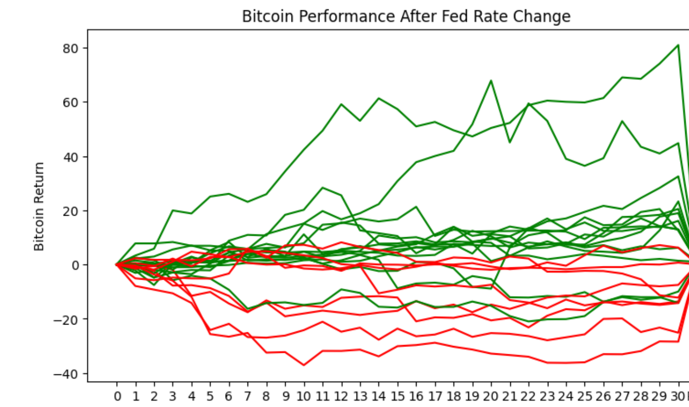

# Quant-Notebook

Repositories is consisted of three parts

## Quant Strategies for Crypto markets notebook

- Notebook contains various ideas and macro information for crypto markets
- Notebook also provides a Macd strategy to be executed

## Bitcoin vs Interest Rates notebook

- Notebook imports interest rates data
- 
- Calculates the correlation between Bitcoin and Interest Rates using change in price after the announcement
- Plots the correlation
- 
- 
- Uses simple linear regression model summary better understand the correlation
- 
- Notebook also provides a simple script to compare the correlation between Bitcoin and various countries interest rates
- 

## Backtest folder

- Executed using command `python3 backtest.py`
- Backtest.py imports the strategy and trade bot to execute the strategy
- 
- 
- 
- Plots cummulatve returns
- 
